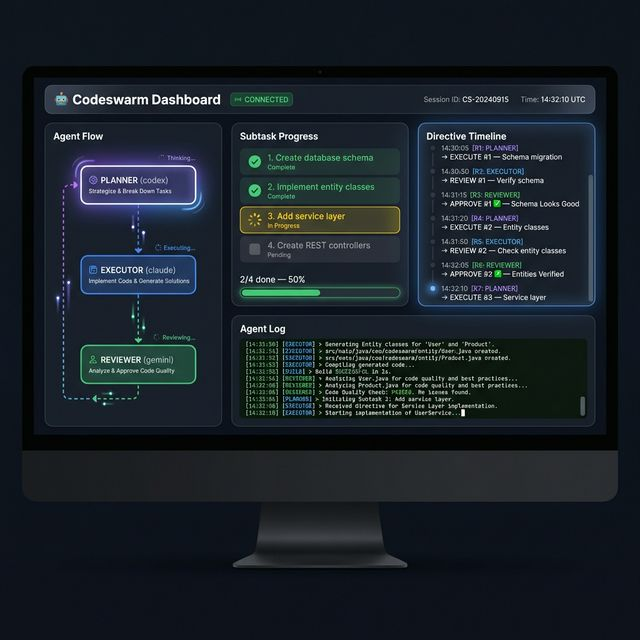

# 🤖 Codeswarm — Multi-Agent AI Orchestration Framework

> Coordinate **Claude Code**, **Gemini CLI**, **Codex CLI**, **Amp**, and **OpenCode** as a unified development team with a planner-driven feedback loop.

[](LICENSE)
[](https://www.npmjs.com/package/codeswarm)
[](https://nodejs.org)

## Why Codeswarm?

Instead of running one AI agent at a time, Codeswarm assigns **different roles** to multiple AI agents:

- 🧠 **Planner** — The brain. Reads feedback, makes ALL decisions, issues directives
- ⚡ **Executor** — Implements changes according to planner instructions
- 🔍 **Reviewer** — Reviews the diff, provides feedback (does NOT approve/reject)
- 🎨 **Frontend Dev** — Handles UI-specific tasks (optional)

The planner is the sole decision-maker. After every action (execute or review), results flow back to the planner, which reads all feedback — including conflicting reviewer opinions — and decides what to do next.

## Architecture

```
                          ┌─────────────┐
                    ┌────▶│  🧠 PLANNER  │◀────┐
                    │     │  (the brain) │     │
                    │     └──────┬───────┘     │
                    │            │              │
                    │     directives            │
                    │     (EXECUTE/             │
                    │      REVIEW/         feedback
                    │      APPROVE/            │
                    │      SKIP/DONE)          │
                    │            │              │
              feedback     ┌────▼────┐         │
              + logs       │EXECUTOR │         │
                    │      └────┬────┘         │
                    │           │               │
                    │      code changes        │
                    │           │               │
                    │      ┌────▼────┐         │
                    └──────│REVIEWER │─────────┘
                           │(feedback│
                           │  only)  │
                           └─────────┘
```

> **Key difference:** Reviewers provide feedback only — they do NOT approve or reject.
> The planner reads all feedback (even conflicting reviews) and makes the final call.

## Quick Start

```bash
# Install globally
npm install -g codeswarm

# Run with a PRD file
codeswarm --project ~/my-app --prd docs/feature.md

# Run with a task description
codeswarm --project ~/my-app --task "Add user authentication with JWT"

# Run with JSON PRD (ralph-style)
codeswarm --project ~/my-app --prd prd.json

# Use specific agents
codeswarm --project ~/my-app \
  --task "Fix pagination bug" \
  --planner codex \
  --executor claude \
  --reviewer gemini,amp

# Use specific models per agent
codeswarm --project ~/my-app \
  --task "Implement caching layer" \
  --executor opencode --reviewer gemini \
  --model opencode:kimi-k2,gemini:gemini-2.5-pro

# Codex with model + reasoning effort
codeswarm --project ~/my-app \
  --task "Complex refactor" \
  --planner codex \
  --model codex:o3:high
```

## Features

### 🔀 Agent-Agnostic Orchestration
Mix and match any combination of supported AI coding agents per role:

| Agent | CLI | Use As |
|-------|-----|--------|
| **Claude Code** | `claude` | Planner, Executor, Reviewer |
| **Gemini CLI** | `gemini` | Planner, Executor, Reviewer |
| **Codex CLI** | `codex` | Planner, Executor, Reviewer |
| **Amp** | `amp` | Executor, Reviewer |
| **OpenCode** | `opencode` | Executor, Reviewer |

### 📋 PRD-First Workflow
Feed a Product Requirements Document (PRD) and Codeswarm breaks it into ordered, dependency-aware user stories:

- **Markdown PRD** — `### US-001: Title` format with acceptance criteria
- **JSON PRD** — Ralph-compatible `prd.json` with `userStories` array
- **Auto-generate** — Provide `--task` and the planner generates a PRD first

### 📊 Real-Time Dashboard
Built-in monitoring dashboard with WebSocket live updates:



- Agent flow visualization (who's running what)
- **Log search** with `Ctrl+F` — search within agent output logs
- **Log download** — export raw agent logs
- **Phase detection** — see if agent is Reading, Implementing, Testing, Building
- **PRD progress** — per-story acceptance criteria pass/fail tracking
- **Directive timeline** — visual history of planner decisions
- Subtask progress with live status updates

```bash
# Start with dashboard
codeswarm --project ~/my-app --prd docs/feature.md --dashboard
```

### 🛡️ Safety Features
- **Watchdog timer** — kills stuck agents that produce no output
- **Retry logic** — handles transient agent failures (API timeouts, connection resets)
- **Session audit trail** — every prompt/log/directive saved to `.codeswarm/sessions/`
- **Dry-run mode** — preview all prompts without executing agents

## Project Structure

```
codeswarm/
├── bin/
│   └── codeswarm.js          # CLI entry point (npm global binary)
├── coordinator.sh             # Core orchestration engine (v7.0)
├── orchestrate.sh             # Legacy sequential pipeline
├── setup.sh                   # Dependency installer
├── config.yaml                # Default agent roles, models, timeouts
├── dashboard/
│   ├── server.js              # Express + WebSocket dashboard server
│   ├── package.json           # Dashboard dependencies
│   └── public/
│       └── index.html         # Dashboard SPA (dark theme, live UI)
├── .codeswarm/
│   └── skills/
│       └── prd_template.md    # PRD generation skill for planner agents
├── docs/
│   ├── prd-template.md        # PRD format template
│   └── prd-example.md         # Example PRD
├── COORDINATOR.md             # Coordinator architecture docs
├── AGENT_TIPS.md              # Per-agent configuration tips
├── TASK_PROTOCOL.md           # How agents communicate via shared files
├── BROWSER_TESTING.md         # Frontend testing with Playwright MCP
├── WORKFLOWS.md               # Workflow definitions
├── playwright.config.ts       # Playwright test configuration
└── package.json               # npm package manifest
```

## CLI Reference

| Flag | Description | Default |
|------|-------------|---------|
| `--project` | Target project directory | **required** |
| `--task` | Task description (auto-generates PRD) | — |
| `--prd` | PRD file path (`.md` or `.json`) | — |
| `--plan` | Existing plan file (skip planning) | — |
| `--planner` | Agent for planning | `codex` |
| `--executor` | Agent for execution | `claude` |
| `--reviewer` | Agent(s) for review (comma-separated) | `gemini` |
| `--fe-dev` | Frontend executor agent | — |
| `--fe-reviewer` | Frontend reviewer agent(s) | — |
| `--max-rounds` | Max planner rounds | `10` |
| `--max-iterations` | Max execute→review cycles per subtask | `5` |
| `--model` | Model per agent (`agent:model[,...]`) | agent default |
| `--dashboard` | Start real-time dashboard | `false` |
| `--tmux` | Use tmux for agent terminals | `false` |
| `--dry-run` | Print prompts without executing | `false` |
| `--verbose` | Show full agent output | `false` |
| `--context` | Comma-separated context files | — |

### 📦 Model Selection

Use `--model` to specify which model each agent should use. Format: `agent:model` (comma-separated for multiple agents).

For **Codex**, you can also set reasoning effort with a third segment: `codex:model:effort`

```bash
# Examples
--model claude:opus                            # Claude with Opus
--model opencode:minimax2.5                    # OpenCode with MiniMax
--model opencode:kimi-k2                       # OpenCode with Kimi K2
--model codex:o3:high                          # Codex with o3 + high effort
--model codex:gpt-5.3-codex:high,gemini:gemini-2.5-pro  # Multiple agents
```

| Agent | Supports `--model` | Effort | Examples |
|-------|--------------------|--------|----------|
| claude | ✅ | — | `opus`, `sonnet`, `claude-opus-4-6-20260212` |
| gemini | ✅ | — | `gemini-2.5-pro`, `gemini-2.5-flash` |
| codex | ✅ | ✅ `--reasoning-effort` | `o3:high`, `gpt-5.3-codex:medium` |
| opencode | ✅ | — | `minimax2.5`, `kimi-k2`, `deepseek-r1` |
| amp | ❌ | — | Configure via Amp settings |

## Configuration

Edit `config.yaml` to set defaults:

```yaml
roles:
  planner: claude
  executor: gemini
  reviewer: codex

models:
  claude: opus
  gemini: ""        # uses default
  codex: ""         # uses default

timeouts:
  planner: 300
  executor: 600
  reviewer: 300

hooks:
  after_plan: ""          # e.g. "./hooks/validate-plan.sh"
  after_execute: ""       # e.g. "npm run build && npm test"
  after_review: ""        # e.g. "./hooks/notify-slack.sh"
```

## Session Artifacts

After a run, find everything under your project:

```
<project>/.codeswarm/
├── task.md                          # Current task plan
├── sessions/session_<timestamp>/
│   ├── coordinator.log              # Full orchestration log
│   ├── metadata.json                # Agent roles metadata
│   ├── prompt_001_codex.md          # Exact prompt sent to planner
│   ├── log_001_codex.md             # Planner output
│   ├── prompt_002_claude.md         # Executor prompt
│   ├── log_002_claude.md            # Executor output
│   ├── prompt_003_gemini.md         # Reviewer prompt
│   ├── log_003_gemini.md            # Reviewer output
│   └── directives/
│       ├── directive_001.md         # EXECUTE #1
│       ├── directive_002.md         # REVIEW #1
│       └── directive_003.md         # APPROVE #1
└── docs/tasks/                      # Archived completed tasks
```

## Documentation

| Document | Description |
|----------|-------------|
| [COORDINATOR.md](./COORDINATOR.md) | Architecture deep-dive and flow diagram |
| [TASK_PROTOCOL.md](./TASK_PROTOCOL.md) | How agents communicate via shared files |
| [AGENT_TIPS.md](./AGENT_TIPS.md) | Per-agent configuration and tips |
| [BROWSER_TESTING.md](./BROWSER_TESTING.md) | Frontend testing with Playwright MCP |
| [WORKFLOWS.md](./WORKFLOWS.md) | Workflow definitions |
| [config.yaml](./config.yaml) | Default role assignments and settings |

## Requirements

- **Node.js** ≥ 18
- **Bash** ≥ 4.0
- At least one AI coding CLI installed:
  - [Claude Code](https://github.com/anthropics/claude-code): `npm i -g @anthropic/claude-code`
  - [Gemini CLI](https://github.com/google-gemini/gemini-cli): `npm i -g @anthropic/gemini-cli`
  - [Codex CLI](https://github.com/openai/codex): `npm i -g @openai/codex`
  - [Amp](https://ampcode.com): Install from website
  - [OpenCode](https://opencode.ai): Install from website
- **jq** (optional, for JSON PRD support): `brew install jq`

## Contributing

```bash
# Clone the repo
git clone https://github.com/mskutlu/codeswarm.git
cd codeswarm

# Install dependencies
./setup.sh

# Run tests
./coordinator.sh --project /tmp/test-project --prd docs/prd-example.md --dry-run
```

## License

MIT © [mskutlu](https://github.com/mskutlu)
